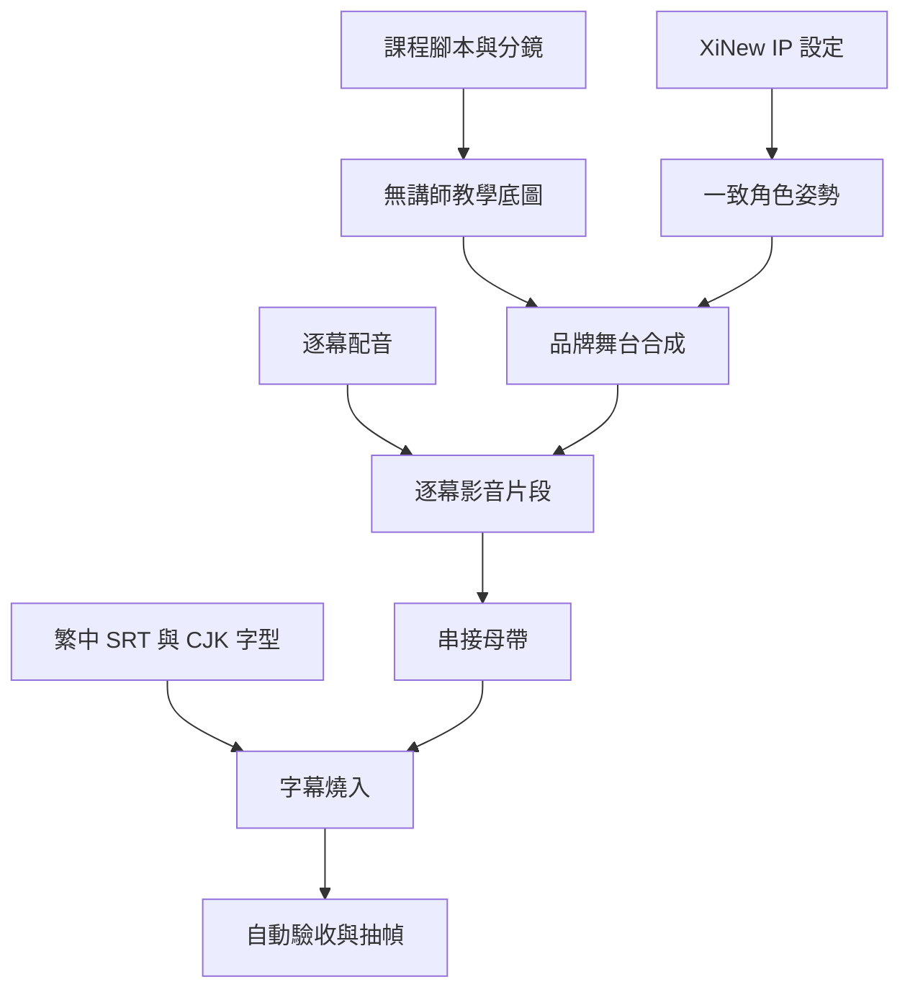

# 製作架構

## 分層責任

| 層 | 內容 | 是否可重生 |
|---|---|---|
| `production/` | 腳本、分鏡、manifest、來源投影片 | 否，屬於創作原件 |
| `assets/characters/` | 講師姿勢與 IP 設定參考 | 否，跨集共用 |
| `assets/slides/` | 品牌舞台與講師合成畫面 | 是 |
| `audio/`、`subtitles/` | 語音與字幕 | 可替換，但需重新 ASR 驗證 |
| `output/` | YouTube 成品、無字幕母帶、封面 | 是 |
| `qc/` | 驗收報告；`clips/` 為中間產物 | 報告保留、片段可重生 |

## 畫面規格

- 畫布：1920×1080。
- 品牌色：深海軍藍、科技藍、琥珀金、暖白。
- 教學內容位於左側發光面板；XiNew 位於右側講師區並可局部跨入面板。
- 下方保留字幕安全區；字幕採半透明深底與繁中 CJK 字型。
- 四種姿勢：歡迎、指示棒講解、重點提示、結尾鼓勵。

