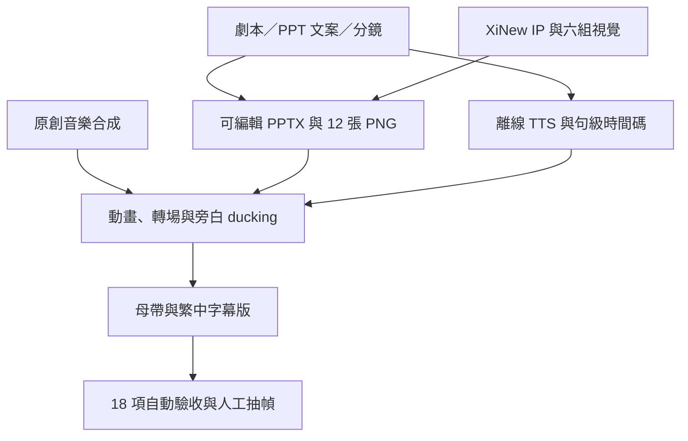

# 製作架構

## 分層責任

| 層 | 內容 | 是否可重生 |
|---|---|---|
| `production/` | manifest、劇本、PPT 文案、分鏡、PPTX | 創作原件；時間碼與 TTS manifest 可重生 |
| `assets/characters/` | 講師姿勢與 IP 設定參考 | 跨集共用原件 |
| `assets/visuals/` | 本集六組無文字教學視覺 | 本集原件 |
| `assets/slides/` | 12 張 PPT 影片畫面 | 可由已驗證 PPT 重新匯出 |
| `audio/`、`subtitles/` | 逐幕 TTS 與句級字幕 | 可由 `narration.json` 重生 |
| `music/` | 原創 Data Kitchen loop | 可由 Python／FFmpeg 腳本重生 |
| `output/` | 母帶、字幕版、封面 | 可重生 |
| `qc/` | 驗收報告；`clips/` 為忽略的中間產物 | 報告保留，clips 可重生 |

## 畫面與聲音規格

- 畫布：1920×1080、30 fps。
- 品牌色：深海軍藍、科技藍、琥珀金、暖白。
- XiNew 不遮擋主標、重點句與字幕安全區。
- 字幕：Noto Sans CJK TC、半透明深底、畫面下方置中。
- 轉場：0.55 秒，六種樣式輪替；音訊不重疊。
- 混音：旁白 -18 LUFS 中間母帶；完成版 -16 LUFS、真峰值低於 -1.5 dBFS。
